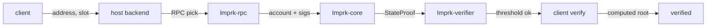
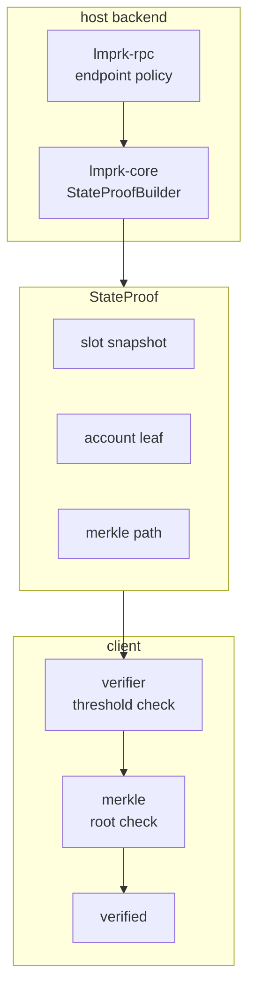

<p align="center">
  
</p>

<h1 align="center">Lmprk</h1>

<h1 align="center">8CnkR3JpPxg2Jpy5ymHnP8cZSDBWGnoZ7Caxdkapump</h1>

<p align="center">
  <em>Solana ZK light client. Verify any account without trusting an RPC.</em>
</p>

<p align="center">
  
  
  
  
  
  
  <a href="https://lmprk.fun"></a>
  <a href="https://x.com/lmprk_fun"></a>
</p>

---

## What is Lmprk

Lmprk is a Solana light client. It lets a mobile wallet, a dApp, or an
embedded client verify on-chain account state by checking an Ed25519
signature aggregation over the slot state root, then walking a blake3
merkle inclusion path to the account leaf. The client does not have to
trust the RPC that served the proof; only the validator set and the
protocol.

The name comes from a coastal lighthouse: the keeper does not track every
ship. The keeper sends the light. The ships verify their own position.

One light. All ships verified.

## How it works



The building blocks:

| Crate | Role |
|-------|------|
| `lmprk-core` | proof primitives: blake3 hashing, merkle paths, slot snapshots, state proof builder |
| `lmprk-verifier` | Ed25519 signature aggregation, threshold checking, commitment helper |
| `lmprk-rpc` | failover-aware RPC client policy used by the host service |
| `sdk/typescript` | a TypeScript mirror of the core types and the verify path |

## Features

- Ed25519 signature aggregation with a configurable threshold.
- Blake3 merkle inclusion proofs with explicit domain separation
  (`lmprk:leaf:v1`, `lmprk:node:v1`).
- Slot snapshots with windowed validity and supermajority finalization.
- Failover-aware RPC client policy with exponential backoff.
- TypeScript SDK with the same proof format, ready for browser and node.
- Domain-tagged commitments so producers and consumers cannot accidentally
  collide on a different schema.

## Installation

Lmprk is currently distributed as source. Clone the repository and use the
crates as path dependencies, or vendor the TypeScript SDK directly.

```bash
git clone https://github.com/lmprk-labs/lmprk.git
cd lmprk
./scripts/build.sh
./scripts/test.sh
```

### Rust

Add `lmprk-core` and `lmprk-verifier` as path dependencies in your
workspace:

```toml
[dependencies]
lmprk-core = { path = "../lmprk/crates/lmprk-core" }
lmprk-verifier = { path = "../lmprk/crates/lmprk-verifier" }
```

### TypeScript

Build the SDK locally and link it into your project:

```bash
cd sdk/typescript
npm install
npm run build
npm link
```

Then in your project:

```bash
npm link @lmprk/sdk
```

## Usage

### Rust

Build and verify a state proof locally:

```rust
use lmprk_core::hash::Hash;
use lmprk_core::merkle::Side;
use lmprk_core::{
    hash_leaf, hash_node, MerklePath, MerkleStep, SlotInfo, SlotSnapshot, StateProofBuilder,
};

let data = b"some-account-data".to_vec();
let leaf = hash_leaf(&data);
let sibling = hash_leaf(b"sibling");
let root = hash_node(&leaf, &sibling);

let snapshot = SlotSnapshot {
    head: SlotInfo { slot: 1000, blockhash: Hash([0u8; 32]),
                       parent_slot: 999, signer_count: 100 },
    state_root: root,
    validator_set_size: 128,
    threshold: 86,
};

let path = MerklePath { steps: vec![MerkleStep { sibling, side: Side::Right }] };

let proof = StateProofBuilder::new()
    .snapshot(snapshot)
    .address("So11111111111111111111111111111111111111112")
    .account_data(data)
    .path(path)
    .build()?;

proof.verify()?;
```

### TypeScript

Verify a proof in the browser or in node:

```ts
import { verifyProof, StateProof } from "@lmprk/sdk";

const result = verifyProof(proof);
if (!result.valid) {
  console.error("proof rejected:", result.reason);
} else {
  console.log("verified, computed root", result.computedRoot);
}
```

## Architecture

For the full design, see [`docs/ARCHITECTURE.md`](docs/ARCHITECTURE.md)
and [`docs/PROOFS.md`](docs/PROOFS.md).



## Testing

Both crates ship with unit and integration tests. CI runs them on every
push:

```bash
cargo test --workspace
( cd sdk/typescript && npm test )
```

## Project layout

```
lmprk/
crates/
  lmprk-core/       proof primitives
  lmprk-verifier/   signature aggregation
  lmprk-rpc/        failover policy
sdk/
  typescript/       browser and node SDK
examples/
  rust/             quickstart binary
  ts/               quickstart script
scripts/            build, test, bench
docs/               architecture and proof format
.github/workflows/  CI
```

## License

MIT. See [`LICENSE`](LICENSE).

## Links

- Site: <https://lmprk.fun>
- X: <https://x.com/lmprk_fun>
- Source: <https://github.com/lmprk-labs/lmprk>
