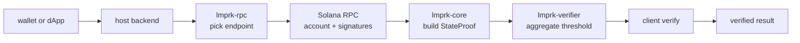

# Lmprk architecture

Lmprk is a small Solana light client. It carries three concerns:

1. Snapshot the slot, validator set, and state root the light client trusts.
2. Verify Ed25519 signature aggregation reaches the configured threshold over a
   slot/state-root commitment.
3. Verify a merkle inclusion path from an account leaf to that state root.

Together those three steps let a client prove that an account had a given value
at a given slot without trusting any single RPC.

## Crates

- `lmprk-core`     proof primitives: hashing, merkle paths, snapshots, state
  proofs, builder.
- `lmprk-verifier` signature aggregation, threshold check, commitment helper.
- `lmprk-rpc`      failover-aware RPC client policy used by the host service.
- `sdk/typescript` a TypeScript mirror of the core types and the verify path.

## Data flow

## Protocol versioning

Every proof carries a `protocol` tag and a `version`. The current values are
`lmprk/v1` and `1`. The verifier refuses anything else, so rolling upgrades
require both producer and consumer to ship a new release at the same time.

## Domain separation

Hashing is blake3 with explicit domain tags:

- `lmprk:leaf:v1` for leaves
- `lmprk:node:v1` for inner nodes
- `lmprk:verifier:v1` for the slot/state-root commitment

Domain separators are part of the protocol; changing them is a breaking change.

## Performance notes

The verifier reuses the same blake3 hasher across all path steps, which keeps
allocation per-step at zero. The merkle path length is bounded by 32 in the
default configuration, putting the worst-case verifier cost at roughly 32
blake3 compressions plus one signature batch.

## Failure modes

When the verifier returns an error the host backend decides whether the proof
is recoverable. The `LmprkError` enum maps every failure to a specific variant
so callers can branch without inspecting strings.
