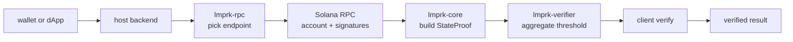

# Lmprk architecture

Lmprk is a small Solana light client. It carries three concerns:

1. Snapshot the slot, validator set, and state root the light client trusts.
2. Verify Ed25519 signature aggregation reaches the configured threshold over a
   slot/state-root commitment.
3. Verify a merkle inclusion path from an account leaf to that state root.

Together those three steps let a client prove that an account had a given value
at a given slot without trusting any single RPC.

## Crates

- `lmprk-core`     proof primitives: hashing, merkle paths, snapshots, state
  proofs, builder.
- `lmprk-verifier` signature aggregation, threshold check, commitment helper.
- `lmprk-rpc`      failover-aware RPC client policy used by the host service.
- `sdk/typescript` a TypeScript mirror of the core types and the verify path.

## Data flow

